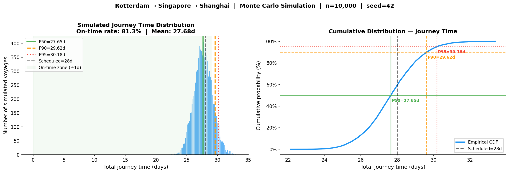
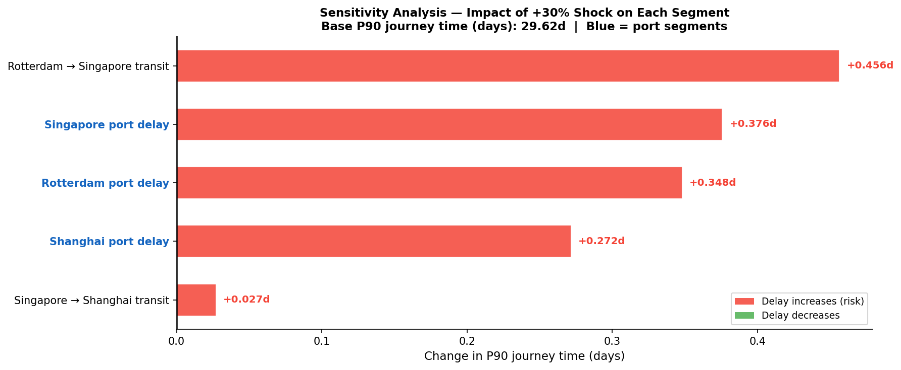

# Shipping Reliability Simulator

> **Can we replace the scheduled transit time with a probability?**
> This project builds a Monte Carlo simulation engine to answer exactly that —
> quantifying delivery reliability on the Rotterdam → Singapore → Shanghai
> trade lane using real port performance and congestion data.

---

## Executive Summary

Container shipping schedules are deterministic by design but stochastic in
reality. This project challenges that assumption by building a data-driven
Monte Carlo simulation that models the Rotterdam → Singapore → Shanghai
route under real-world variability. Using six years of UNCTAD port
performance data and IMF PortWatch AIS-based congestion signals, the
simulation reveals that the standard 28-day schedule is only met within
±1 day on **81.35%** of simulated voyages — and that a **1.62-day reliability
buffer** is needed to guarantee 90% on-time delivery. The project
demonstrates how stochastic modelling can replace point estimates with
probability distributions as the basis for network design decisions.

---

## Business Context

**The problem:** Container carriers publish fixed transit schedules, but port
delays, weather variability, and congestion cause most vessels to deviate.
Network designers who rely on scheduled transit times alone are
systematically under-estimating delivery risk.

**The question:** For a given trade lane, what is the true probability
distribution of total journey time — and which segments drive the most
reliability risk?

**Why it matters:** A 1-day buffer shortfall at P90 means 1 in 10 shipments
misses its commitment. At the scale of a major carrier running hundreds of
vessels on Asia–Europe lanes, that tail materialises constantly — translating
directly into service failure costs, rebooking, and customer churn.

---

## Key Results

| KPI | Value |
|---|---|
| Scheduled journey | 28.0 days |
| Simulated mean | **27.68 days** |
| P90 delivery time | **29.62 days** |
| P95 delivery time | 30.18 days |
| On-time rate (±1 day) | **81.35%** |
| Reliability buffer needed (P90) | **+1.62 days** |
| Worst case (P99) | 31.24 days |

**Bottom line:** To guarantee 90% on-time delivery, planners need to add
1.62 days to the scheduled transit time. A planner using the schedule alone
will be wrong the majority of the time — 59% of voyages arrive early and
19% arrive more than 1 day late.



---

## Sensitivity Analysis — Where Risk Lives

A +30% stress test applied to each segment independently reveals the
reliability risk hierarchy:

| Segment | P90 impact | Finding |
|---|---|---|
| Rotterdam → Singapore transit | **+0.46 days** | Highest risk — long-haul variability dominates |
| Singapore port delay | +0.38 days | Sensitive to network-wide disruptions |
| Rotterdam port delay | +0.35 days | Moderate sensitivity, below-baseline 2023 congestion |
| Shanghai port delay | +0.27 days | Policy-driven variability, not congestion |
| Singapore → Shanghai transit | +0.03 days | Most predictable leg — minimal risk |

The long-haul transit leg from Rotterdam to Singapore drives more
reliability risk than all three port calls combined. This is counter-intuitive
— and exactly the kind of insight that simulation surfaces that a
deterministic schedule never would.



---

## What I Built

```
Real data → EDA → Distribution fitting → Monte Carlo engine → KPIs + Sensitivity
```

**Notebook 01 — EDA & Preprocessing:**
Loaded and cleaned IMF PortWatch daily port activity (5.1M rows) and UNCTAD
port call statistics (2018–2023). Built a daily congestion index per port,
handled Singapore's missing 2018–2021 data via a ratio-based imputation
strategy, and discovered that congestion correlates with dwell time
*differently* at each port — a finding that changed the entire modelling approach.

**Notebook 02 — Distribution Fitting:**
Fitted four candidate distributions (Gamma, Log-normal, Weibull, Exponential)
to delay samples synthesised from UNCTAD annual medians. All three ports
were best described by a **Gamma distribution** (KS p-values all > 0.79).
Port-specific congestion multipliers were calibrated from the EDA correlation
findings rather than assumed.

**Notebook 03 — Simulation Results:**
Built a modular, seed-controlled Monte Carlo simulator. Runs 10,000 iterations
per scenario, applies port-specific congestion multipliers, and outputs
P50/P90/P95 KPIs, segment contributions, sensitivity analysis, and
scenario comparisons.

---

## Technical Approach

### Route modelled

| Segment | Type | Scheduled | Distribution |
|---|---|---|---|
| Rotterdam port delay | Port | 1.0d | Gamma(3.92, 0, 0.243) — fitted |
| Rotterdam → Singapore | Transit | 21.0d | Normal(21.0, 1.26) |
| Singapore port delay | Port | 1.0d | Gamma(4.11, 0, 0.242) — fitted |
| Singapore → Shanghai | Transit | 4.0d | Normal(4.0, 0.24) |
| Shanghai port delay | Port | 1.0d | Gamma(3.70, 0, 0.201) — fitted |

### Port-specific congestion multipliers

EDA showed the congestion–dwell time relationship is not universal:

| Port | Correlation (r) | Strategy | Why |
|---|---|---|---|
| Rotterdam | −0.53 | Dampened: `1 + 0.3×(CI−1)` | Automated port — COVID protocols drove delays, not volume |
| Singapore | −0.89 | Inverse: `1 − 0.5×(CI−1)` | Hub port — quiet periods correlated with network-wide backlogs |
| Shanghai | +0.05 | None | Policy-driven variability — lockdowns and customs, not congestion |

A universal multiplier was explicitly rejected based on the data.

---

## What Didn't Work & What I Learned

**Congestion as a universal multiplier — rejected.**
The original plan was a single multiplier across all ports. EDA showed
correlations of −0.53, −0.89, and +0.05 respectively. A universal multiplier
would have introduced systematic error. Lesson: always validate modelling
assumptions against data before implementing them.

**UNCTAD Singapore data — missing for 2018–2021.**
Rather than dropping Singapore or using a global mean, I derived a
port-specific ratio from the 2022–2023 period and applied it backwards.
This preserved the temporal structure while being transparent about the
method. Lesson: document data gaps and imputation choices explicitly —
they are part of the analytical rigour, not something to hide.

**The disruption dataset — assessed and honestly discarded.**
The IMF PortWatch disruption dataset (127 events, 2022–2023) contained
zero events affecting our three ports. The right decision was to document
this clearly as a limitation rather than build a disruption model with no
empirical support. Lesson: the honest choice is often the stronger choice.

**The most important insight — direction matters more than magnitude.**
Going in, the assumption was that busier ports mean longer delays. The data
showed the opposite for Rotterdam and Singapore. Operational disruption
(COVID protocols, cascading network effects) mattered more than traffic
volume. This is the insight that only emerges from looking at the data — and
the one that most directly demonstrates the value of simulation over
schedule-based planning.

---

## Data Sources

| Dataset | Source | Used for |
|---|---|---|
| Daily port activity 2019–2026 | [IMF PortWatch](https://portwatch.imf.org) | Congestion index |
| Time in port — container ships 2018–2023 | [UNCTAD](https://unctadstat.unctad.org) | Delay distribution fitting |
| Port calls — container ships 2018–2023 | [UNCTAD](https://unctadstat.unctad.org) | Congestion validation |

All data is publicly available and free. Raw data is gitignored.
Processed outputs are committed and sufficient to run Notebooks 02 and 03.

---

## Project Structure

```
shipping-reliability-simulator/
├── data/
│   ├── raw/                              # gitignored — see setup below
│   └── processed/                        # committed — all cleaned outputs
│       ├── congestion_monthly.csv
│       ├── fitted_distributions.json
│       ├── ports_filtered.csv
│       └── time_in_port_clean.csv
├── figures/
│   ├── eda_part/
│   ├── distribution_fitting/
│   └── simulation/
├── simulator/
│   ├── distributions.py
│   ├── route.py
│   └── monte_carlo.py
├── analysis/
│   ├── kpis.py
│   └── sensitivity.py
├── notebooks/
│   ├── 01_eda_analysis.ipynb
│   ├── 02_distribution_fitting.ipynb
│   └── 03_simulation_results.ipynb
├── tests/                                # 25 tests, all passing
├── outputs/
├── conftest.py
├── pytest.ini
└── requirements.txt
```

---

## Setup

```bash
# Clone
git clone https://github.com/yourusername/shipping-reliability-simulator
cd shipping-reliability-simulator

# Environment
conda activate shipping-sim
pip install -r requirements.txt

# Tests
pytest tests/ -v
# Expected: 25 passed

# Run notebooks in order
jupyter notebook notebooks/01_eda_analysis.ipynb
jupyter notebook notebooks/02_distribution_fitting.ipynb
jupyter notebook notebooks/03_simulation_results.ipynb
```

### Getting the raw data

| File | Source |
|---|---|
| `daily_ports.csv` | portwatch.imf.org → Access Data → Daily Port Activity |
| `disruptions.csv` | portwatch.imf.org → Access Data → Disruptions |
| `port_calls.csv` | unctadstat.unctad.org → Maritime → Time in port → Container ships |
| `port_calls_arr.csv` | unctadstat.unctad.org → Maritime → Number of port calls → Container ships |

Place all files in `data/raw/`.

---

## Assumptions

| # | Assumption | Rationale |
|---|---|---|
| A1 | Transit variability: Normal(μ, σ=0.06μ) | Standard industry proxy — no direct data |
| A2 | UNCTAD time in port includes berth service time | Documented data limitation |
| A3 | Congestion baseline = 2019 average | Last full pre-COVID year |
| A4 | Singapore 2018–2021 imputed via China ratio (×0.896) | UNCTAD data missing |
| A5 | CV=0.5 for sample synthesis | Standard port dwell time literature |
| A6 | No disruption layer | Zero GDACS events for our 3 ports in 2022–2023 |
| A7 | Seed=42 throughout | Full reproducibility |

---

## Future Work

- **Second route for comparison:** Direct Rotterdam → Shanghai (Suez) vs
  Singapore transhipment — a direct network design trade-off comparison
- **Time-varying congestion:** Monthly congestion indices fed into the
  simulation instead of a fixed annual average
- **Vessel-level AIS data:** Replace synthesised samples with real
  arrival/departure records for stronger distribution fitting
- **Correlated disruption model:** Simultaneous multi-port shocks
  (e.g. Suez Canal blockage) which the current independent model cannot capture

---

## Status

| Phase | Status |
|---|---|
| Data collection | ✅ Complete |
| EDA & preprocessing | ✅ Complete |
| Distribution fitting | ✅ Complete |
| Simulator modules | ✅ Complete |
| Analysis modules | ✅ Complete |
| Simulation results | ✅ Complete |
| Tests (25/25) | ✅ Complete |

---

## Author

**Victoria Cojocaru** 

[LinkedIn](https://www.linkedin.com/in/cojocaru-victoria/)
